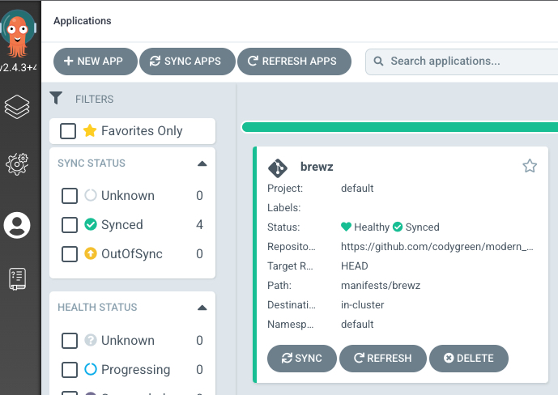

# Argo CD

[Argo CD](https://argoproj.github.io/cd/) is a declarative, GitOps continuous delivery tool for Kubernetes.

In our workshop, we will use Argo CD to deploy our microservices and resources.

## Install Argo CD

```bash
kubectl create namespace argocd
kubectl apply -n argocd -f https://raw.githubusercontent.com/argoproj/argo-cd/stable/manifests/install.yaml

```

## Expose the Argo CD Server API/UI

Save the following manifest to `argocd-nodeport.yml`

```yml
apiVersion: v1
kind: Service
metadata:
  labels:
    app.kubernetes.io/component: server
    app.kubernetes.io/name: argocd-server
    app.kubernetes.io/part-of: argocd
  name: argocd-server-nodeport
  namespace: argocd
spec:
  ports:
    - name: http
      port: 80
      protocol: TCP
      targetPort: 8080
      nodePort: 30007
    - name: https
      port: 443
      protocol: TCP
      targetPort: 8080
      nodePort: 30008
  selector:
    app.kubernetes.io/name: argocd-server
  sessionAffinity: None
  type: NodePort
```

Now, apply the manifest:

```bash
kubectl apply -f argocd-nodeport.yml
```

## Obtain the Argo CD password

```bash
kubectl -n argocd get secret argocd-initial-admin-secret -o jsonpath="{.data.password}" | base64 -d; echo
```

## Login

Use the Argo CD UDF Access Method to access the Argo CD UI and login with the `admin` user and the password you obtain in the previous step.

## Setup Your Repository and deploy Brewz in Argo CD

Save the following contents to `argocd_brewz.yml`

**Note:** Replace OWNER with your GitHub username

```yaml
apiVersion: v1
kind: Secret
metadata:
  name: private-repo
  namespace: argocd
  labels:
    argocd.argoproj.io/secret-type: repository
stringData:
  type: git
  url: https://github.com/OWNER/modern_app_jumpstart_workshop
---
apiVersion: argoproj.io/v1alpha1
kind: Application
metadata:
  name: argo-cd-demo
  namespace: argocd
  finalizers:
    - resources-finalizer.argocd.argoproj.io
spec:
  project: default
  source:
    path: manifests/brewz
    repoURL: https://github.com/OWNER/modern_app_jumpstart_workshop.git
    targetRevision: HEAD
  destination:
    namespace: default
    server: https://kubernetes.default.svc
  syncPolicy:
    automated:
      selfHeal: true
      prune: true
```

Now, apply the manifest:
`kubectl apply -f argocd_brewz.yml`

## View the Argo CD Application

1. Open the Argo CD UDF Access Method under the K3s server
  
1. Click on the argo-cd-demo application in the Argo CD UI and inspect the deployed services and policies

- You should see the individual services as well as the rate-limit-policy from day 1 of the workshop

## Inspect the NGINX Ingress Controller Configuration

Now that Argo CD has deployed out application let's take a look at the NGINX Ingress Controller Virtual Server resources.

**Note:** Refer to the [VirtualServer docs](https://docs.nginx.com/nginx-ingress-controller/configuration/virtualserver-and-virtualserverroute-resources/) for more information.

```shell
kubectl get virtualserver
```

Your output should look similar to:

```shell
NAME    STATE   HOST               IP         PORTS      AGE
brewz   Valid   brewz.f5demo.com   10.1.1.5   [80,443]   29m
```

Let's take a deeper look at the configuration:

```shell
kubectl describe virtualserver brewz
```

Your output should look similar to:

```shell
Name:         brewz
Namespace:    default
Labels:       app.kubernetes.io/instance=argo-cd-demo
Annotations:  <none>
API Version:  k8s.nginx.org/v1
Kind:         VirtualServer
Metadata:
  Creation Timestamp:  2022-06-29T01:36:47Z
  Generation:          1
  Managed Fields:
    API Version:  k8s.nginx.org/v1
    Fields Type:  FieldsV1
    fieldsV1:
      f:status:
        .:
        f:externalEndpoints:
        f:message:
        f:reason:
        f:state:
    Manager:      Go-http-client
    Operation:    Update
    Subresource:  status
    Time:         2022-06-29T01:36:47Z
    API Version:  k8s.nginx.org/v1
    Fields Type:  FieldsV1
    fieldsV1:
      f:metadata:
        f:annotations:
          .:
          f:kubectl.kubernetes.io/last-applied-configuration:
        f:labels:
          .:
          f:app.kubernetes.io/instance:
      f:spec:
        .:
        f:host:
        f:routes:
        f:upstreams:
    Manager:         argocd-application-controller
    Operation:       Update
    Time:            2022-06-29T01:36:47Z
  Resource Version:  4200
  UID:               347d8e8d-bfa4-4bb9-9df5-cb62a2785af0
Spec:
  Host:  brewz.f5demo.com
  Routes:
    Action:
      Pass:  spa
    Path:    /
    Action:
      Pass:  api
    Path:    /api
    Policies:
      Name:  rate-limit-policy
    Action:
      Proxy:
        Rewrite Path:  /images
        Upstream:      api
    Path:              /images
  Upstreams:
    Name:     spa
    Port:     80
    Service:  spa
    Name:     api
    Port:     8000
    Service:  api
Status:
  External Endpoints:
    Ip:     10.1.1.5
    Ports:  [80,443]
  Message:  Configuration for default/brewz was added or updated
  Reason:   AddedOrUpdated
  State:    Valid
```

A few items of interest in the output:

- Spec.Routes.Action:
  - "/" -> spa
  - "/api" -> api
    - with a policy named rate-limit-policy
  - "/images" -> rewrite policy to the api upstream

## Next Steps

Now that you have a base application deployed, let's take a deeper look at the [VirtualServer resource](virtualserver.md).
