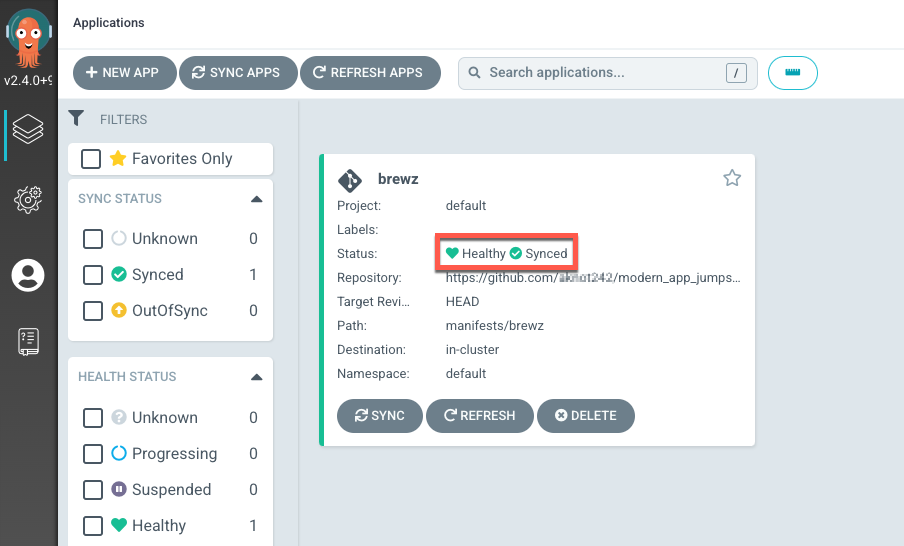
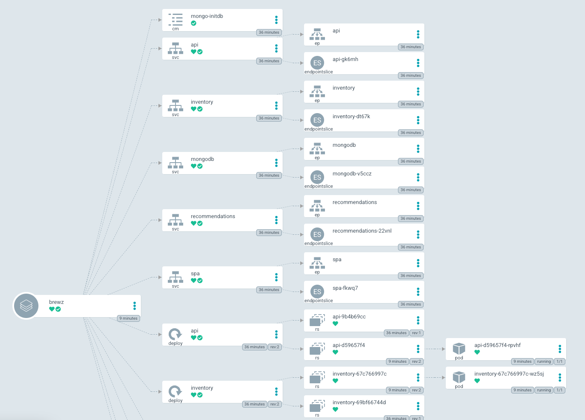

# Setup
To start the monolith to microservices senario you will first need to ensure the following items are installed on your laptop:

- [Visual Studio Code](https://code.visualstudio.com/)
- [git](https://git-scm.com/downloads)
- [kubectl](https://kubernetes.io/docs/tasks/tools/)
- [GitHub CLI - optional](https://cli.github.com/)

## Fork the workshop repository
To proceed with this senario, you will need to fork the workshop repository to your GitHub account.  If this is your first time, then take a few minutes to review the [GitHub Docs on how to Fork a repo](https://docs.github.com/en/get-started/quickstart/fork-a-repo).

You can complete this task through the GitHub UI: 


or via the GitHub CLI:

```bash
gh repo clone f5devcentral/modern_app_jumpstart_workshop
```

## Clone your workshop repository to your laptop
Now that you have forked the workshop repository, you'll want to clone the repo to your local laptop.  You can do this via the git or GitHub CLI commands.

**Note:** Make sure to replace your_username with your GitHub username.
**Note:** If you have not [configured GitHub authentication](https://docs.github.com/en/authentication) with your local laptop, please stop and do that now.

Git:
```bash
# via HTTPS
git clone https://github.com/your_username/modern_app_jumpstart_workshop.git modern_app_jumpstart_workshop
# via SSH
git clone git@github.com:your_username/modern_app_jumpstart_workshop.git modern_app_jumpstart_workshop
```

## Generate Local Kubeconfig

To access the K8s API, you will need to download a kubeconfig file from the K3s server in your UDF blueprint.

In your UDF deployment, click the Components tab then for the k3s system click the Access dropdown then the KUBECONFIG access method.

This will present a webpage with a link to download the config-udf.yaml file.

Once the file is downloaded, set your KUBECONFIG environment variable to point to this location. For more information, reference the [K8s docs](https://kubernetes.io/docs/concepts/configuration/organize-cluster-access-kubeconfig/#the-kubeconfig-environment-variable). 

Now, test that your settings are correct:
```bash
kubectl get nodes
```

## Manually deploy the Brewz application using manifests

```bash
cd manifests/brewz
kubectl apply -f mongo-init.yml
kubectl apply -f app.yml
kubectl apply -f virtual-server.yml
```

Use the **Brewz** UDF access method to explore the deployed app in your browser. Click the "BREWZ" title link to navigate to the main product catalog.


## GitOps with Argo CD

### Obtain the Argo CD password 
To leverage the Argo CD UI, you will need to obtain the password created at install - save this for later use. 
```bash
kubectl -n argocd get secret argocd-initial-admin-secret -o jsonpath="{.data.password}" | base64 -d; echo
```

Now open the Argo CD Access Method for the K3s server and login with *admin* and the password obtained from the previous step.

Once logged in, click the **CREATE APPLICATION** button. Enter the following values:

| **Name**               | **Value**                                       |
|------------------------|-------------------------------------------------|
| Application Name       | brewz                                           |
| Project Name           | click and select "default"                      |
| Sync Policy            | click and select "Automatic"                    |
| SELF-HEAL checkbox     | checked                                         |
| Repository URL         | *your forked repo url*                          |
| Path                   | manifests/brewz                                 |
| Cluster URL            | click and select https://kubernetes.default.svc |
| Namespace              | default                                         |

Click the **CREATE** button.

Argo CD will initiate an initial "sync" which will update the manually deployed application with the manifests in your GitHub repo. If successful, you should see this:



Click anywhere in the **brewz** application card pictured above. You will be presented with a diagram of all the k8s resources that have been deployed:




## Introduce API rate-limiting

Currently, there is no limitation on the rate that clients may query the product catalog. We would like to implement a rate limiting feature on the API to prevent a general degradation of service condition caused by unwanted users of the Brewz site.

Test the initial state of the API with ApacheBench:

```bash
BREWZ_URL=<Your Brewz UDF access method url>
ab -n 10 -c 5 $BREWZ_URL/api/products
```

Note that ApacheBench should report `Complete requests: 10`, `Failed requests: 0` in its results.

We will create a rate limiting policy for NGINX Ingress Controller, and attach it specifically to the `/api` VirtualServerRoute that has already been defined.

Open your forked workshop GitHub repo in VSCode. Ensure you are working on the `main` branch, and it is up to date. Create a `manifests/brewz/rate-limit.yml` file with the following contents, and save the file:

```yaml
---
apiVersion: k8s.nginx.org/v1
kind: Policy
metadata:
  name: rate-limit-policy
spec:
  rateLimit:
    rate: 10r/s
    key: ${binary_remote_addr}
    zoneSize: 10M
```

Edit the existing `manifests/brewz/virtual-server.yml` file to add the rate limiting policy to the /api path. The file should now look like this:

```yaml
---
apiVersion: k8s.nginx.org/v1
kind: VirtualServer
metadata:
  name: brewz
spec:
  host: brewz.f5demo.com
  upstreams:
    - name: spa
      service: spa
      port: 80
    - name: api
      service: api
      port: 8000
  routes:
    - path: /
      action:
        pass: spa
    - path: /api
      policies:
        - name: rate-limit-policy
      action:
        pass: api
    - path: /images
      action:
        proxy:
          upstream: api
          rewritePath: /images
```

Save this file. Stage the changes, and commit them to your local repository. Push the changes to your remote repository.

Commit it directly to your main branch. Return to the Argo CD UI, and click refresh after 30 seconds or so has elapsed. Note that an automatic synchronization has occurred, and you will now see that the `rate-limit-policy` object has been added to the object graph. You may optionally click on it to view the configuration details associates with it including its deployment status.

Test the new rate limiting settings with ApacheBench:

```bash
ab -n 10 -c 5 $BREWZ_URL/api/products
```

Note that ApacheBench should report `Complete requests: 10` however, `Failed requests` and `Non-2xx responses` should start to appear in its results with non-zero values. Why? When the number of requests per second per unique client IP configured in the rate limit policy had been exceeded, NGINX Ingress Controller started to respond with a `503 Service Unavailable` HTTP response, which signified an error response to ApacheBench.
